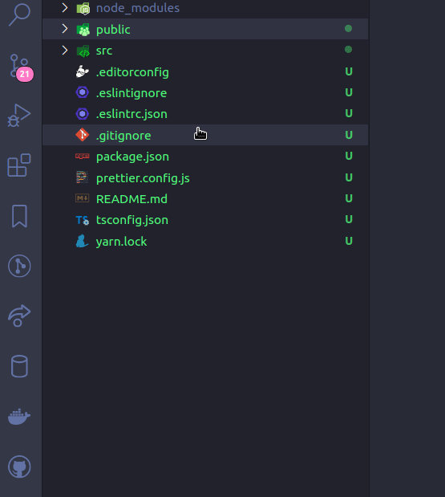

##  Template default para projetos ReactJS com TypeScript

###  Tecnologias
:rocket: ReactJS Typescript Prettier Eslint

## Estrutura do projeto
  

## ✋🏻 Pré-requisitos

- [Node.js](https://nodejs.org/en/)
- [Yarn](https://yarnpkg.com/pt-BR/docs/install)

## :pencil2: Development setup
```sh
npm install or yarn
npm start or yarn start
```

## 👨🏼‍💻 Desenvolvido por

- [Caique Queiroz](https://github.com/clqueiroz)
