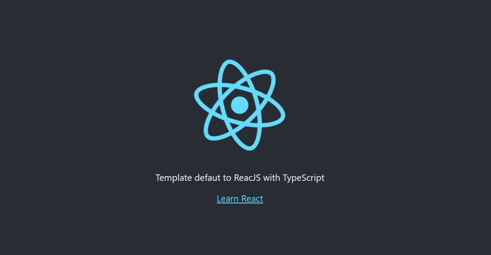

# Template default para projetos ReactJS com TypeScript

## :rocket: :rocket: Projeto simples para treinar

# Tecnologias

ReactJS Typescript Prettier Eslint :purple_heart: :purple_heart: :purple_heart:



## :pencil2: Development setup

```sh
npm install or yarn
npm start or yarn start
```

## Desenvolvido por:

:coffee: :computer: Caique Onisto Queiroz
